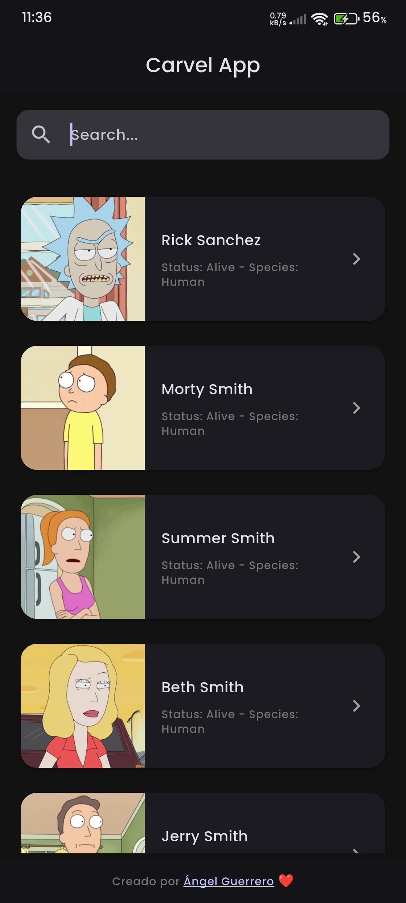
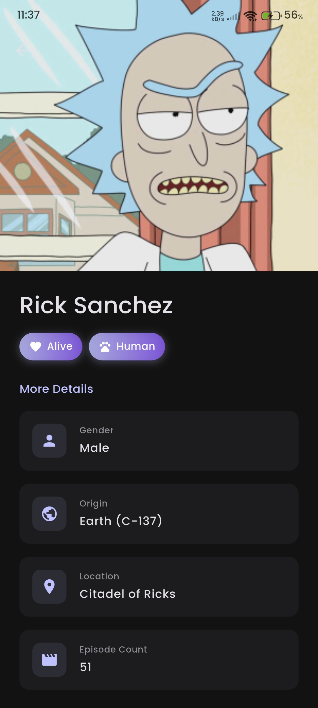

# Carvel Home Assessment - Flutter API Consumer App

A modern Flutter application that consumes public APIs and displays data in a clean, responsive UI with Material Design 3.

## Features

- ✨ Clean Architecture with separation of concerns
- 🎨 Modern Material Design 3 UI
- 🔄 Riverpod state management
- 📱 Fully responsive design
- 🔍 Real-time search with debounce
- ♾️ Infinite scrolling with pagination
- 🎭 Beautiful animations (Hero, Fade, Shimmer, Scale)
- 🖼️ Cached network images
- 🎯 GoRouter for declarative navigation
- 🌓 Light & Dark theme support
- ⚡ Pull-to-refresh functionality
- 📊 Loading skeletons with Shimmer effect

## Architecture

The app follows Clean Architecture principles with three main layers:

```
lib/
├── core/               # Core utilities, constants, theme, and network
├── data/              # Data layer (models, datasources, repositories)
└── presentation/      # UI layer (screens, widgets, providers, router)
```

### Key Design Patterns

- **Repository Pattern**: Abstraction between data sources and business logic
- **Provider Pattern**: Riverpod for state management
- **Proxy Pattern**: ApiClient acts as an HTTP intermediary (similar to axios in JavaScript)

## Getting Started

### Prerequisites

- Flutter SDK (3.9.2 or higher)
- Dart SDK
- An IDE (VS Code, Android Studio, or IntelliJ)

## App Screenshots

Here are some screenshots of the app in action:

### Home Screen with Item List


### Item Details Screen


### Installation

1. Clone the repository
```bash
git clone <repository-url>
cd carvel_home_assessment
```

2. Install dependencies
```bash
flutter pub get
```

3. Run the app
```bash
flutter run
```

## How to Switch APIs

The app is designed to be flexible and support multiple APIs. Currently implemented:

- Rick and Morty API (default)
- The Dog API
- The Cat API

### To change the API:

1. Open `lib/presentation/providers/items_provider.dart`

2. Locate the `apiDataSourceProvider`:

```dart
final apiDataSourceProvider = Provider<ApiDataSource>((ref) {
  final client = ref.watch(apiClientProvider);
  return RickAndMortyDataSource(client);  // Change this line
});
```

3. Replace with your desired datasource:

**For Dog API:**
```dart
return DogApiDataSource(client);
```

**For Cat API:**
```dart
return CatApiDataSource(client);
```

### To add a new API:

1. Create a new class in `lib/data/datasources/api_datasource.dart` that implements `ApiDataSource`

2. Add a factory constructor in `lib/data/models/item_model.dart` for the new API format

3. Add endpoints to `lib/core/constants/api_endpoints.dart`

Example:
```dart
class MyNewApiDataSource implements ApiDataSource {
  final ApiClient _client;
  
  MyNewApiDataSource(this._client);
  
  @override
  Future<List<ItemModel>> fetchItems({int page = 1, int limit = 20}) async {
    // Implementation
  }
  
  @override
  Future<ItemModel> fetchItemById(String id) async {
    // Implementation
  }
  
  @override
  Future<List<ItemModel>> searchItems(String query) async {
    // Implementation
  }
}
```

## Project Structure Details

### Core Layer
- **network/**: HTTP client, API responses, and exception handling
- **constants/**: App-wide constants and API endpoints
- **theme/**: Material Design 3 theme configuration

### Data Layer
- **models/**: Data models with factory constructors for different APIs
- **datasources/**: API-specific implementations
- **repositories/**: Repository pattern for data abstraction

### Presentation Layer
- **providers/**: Riverpod providers for state management
- **screens/**: UI screens and their widgets
- **router/**: GoRouter configuration

## Dependencies

- `flutter_riverpod` - State management
- `riverpod_annotation` - Code generation for Riverpod
- `http` - HTTP client
- `cached_network_image` - Image caching
- `shimmer` - Loading skeleton animations
- `go_router` - Declarative routing

## Design Decisions

1. **Riverpod over Provider**: More type-safe and better testing support
2. **GoRouter**: Declarative routing with better deep linking support
3. **Generic ItemModel**: Flexible model that adapts to different API responses
4. **ApiClient as Proxy**: Centralized HTTP handling similar to axios services in JavaScript
5. **Material Design 3**: Modern, clean UI with adaptive theming

## Code Quality

- ✅ All code in English
- ✅ Self-documenting variable and function names
- ✅ Minimal comments (only where necessary)
- ✅ No linter errors
- ✅ Clean code principles (SOLID, DRY)

## Testing the App

1. Launch the app
2. Scroll through the list of items (auto-loads more on scroll)
3. Use pull-to-refresh to reload
4. Search for items using the search bar
5. Tap on any item to view details with Hero animation
6. Navigate back to see smooth transitions

## Future Enhancements

- Unit tests for repositories and providers
- Widget tests for UI components
- Integration tests
- Offline support with local caching
- Favorites functionality
- Filtering options
- Share functionality

## License

This project is part of the Carvel technical assessment.
